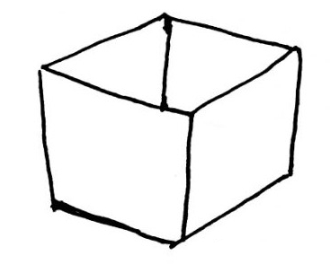

# Hitzaurrea

Liburu hau programatzen ikasteko gida bat da. Horretarako, ahalik eta tresnarik sinpleenak erabiltzen ditu:
- Python bezalako lengoai erraza.
- Hasieratik programak idazteko ariketak.

Adibide errazenetik hasi eta pixkanaka teknika berriak sartzen dira.
Baina zerbait argi izan behar duzu. Irakurtzera mugatzen bazara, baliteke ideiaren batekin geratzea, baina benetan programatzen **ez duzu ikasiko** . _Pro_ bat izateko, ordenagailua aurrean izan behar duzu eta hemen azaltzen dizuguna praktikatu. Proposatutako ariketak egiten, idazten, probatzen eta zure gustura hobetzen saiatu behar duzu. Izan ere, programazioa, **programatzen ikasten da** .
Horretarako, liburu hau, ebatzitako ariketak eta web orri bat jartzen ditugu zure eskura. Bertan sartu besterik ez duzu egin behar, eta proposatzen dizkizugun praktikekin jolastu ahal izango duzu.

# Zer da programazioa?

Ordenagailuak azkarrak dira eta memoria izugarria dute: segundoko milioika erakigeta exekutatzeko eta datu kopuru imajinaezinak kudeatzeko gai diren makinak dira. Baina horrek ez du esan nahi adimentsuak direnik. Berez ez dakite ezer egiten. Ordenagailu bat, edo *tableta* bat, mugikor bat,
edozer gauza egiteko, programa bat exekutatu behar dute. Eta programa bat programatzaileek idatzitako agindu multzo bat da.

Programazioaren alderdi interesgarriena da makinaren kontrola har dezakegula, hark guk nahi duguna egin dezan: agindu sinple batetik hasi eta nabigatzaile edo joko oso konplexuak programatzeraino. Programazioa zoragarria da; zergatik? nahi duzuna sor dezakezulako. Muga bakarrak zure irudimena eta trebetasunak izango dura

Baina zein hizkuntzatan komunikatu gaitezke ordenagailuekin? Horietako asko daude. Barnean, ordenagailuak lengoai bitarra erabiltzen du, hau da, interpretatzeko gai den zero eta bat zenbakien sekuentzia: 00100100111011001... Hala ere, programazio lana errazteko, lengoai sinpleagoak daude, pertsonen hizkuntzaren antz handia dutenak.

Python lengoaia horietako bat da, eta alde on asko ditu: sinplea da, ikasteko oso erraza, edozer egiteko aukera ematen du, liburutegi ugari ditu eta, gainera, modu profesionalean erabiltzen da. Liburu honetan Python erabiliz programatzen ikasiko duzu. Pixkanaka, lengoaiak eskaintzen dizkizun tresna berriak ezagutuko dituzu, programa konplexuagoak sortzen ikasteko.

Zer behar duzu oraintxe bertan hasteko? Nabigatzaile bat: Chrome, Firefox, etab. Lehenengo kapitulutik programatzen hasiko gara. Programatzen ikasteko modurik onena... programatzea da! Ez da beldurrik izan behar, eta, gainera, dibertigarriena da. Beraz, nahikoa da. Pasa hurrengo kapitulura zure lehen programa idazteko!

Oharra:
Agian entzuna duzu ordenagailuek adimen artifiziala izan dezaketela edo baliteke bideojokoetan etsaiak zu baino azkarragoak iruditzea. Egia esan, ordenagailuak jokabide adimendunak imitatzen dituzten programak exekutatzen ditu.

2. oharra:
Ohiko programazio-ingurune bat instalatu nahi baduzu, zoaz bukaerako eranskin kapitulura.

# Programazio ingurunea

Interneterako konexioa duen edozein ordenagailutan sartu:

https://repl.it/

Hortik, `Sign up for free` sakatu


Kontu berria sortu edo Google kontuarekin konektatu:


Behien repl.it barruan zaudela, new repl botoia sakatu:


Hurrengo pantaila ikusiko duzu. Bilatu **Python** eta hasieratu ingurunea


Behin hori eginda, programazio ingurunea kargatuko da, hiru gune nagusi dira hemen:


- Ezkerrean, programa idazteko editorea duzu.
- Eskuinean, kontsola, non ikusiko duzun emaitza programa exekutatzen duzunean.
- Goiko aldean, **Run** botoia, programa nahi beste aldiz exekutatzeko.

Repl.it. gunean izen ematea gomendatzen dizugu. Horrela, egiten dituzun programa guztiak gordeta eta lokalizatuta izango dituzu.

Beste _online_ aukerak:

- https://paiza.io/es
- https://www.programiz.com/python-programming/online-compiler /

# Kaixo mundua


Programatzaileek idatzi ohi duten lehen programa mezu bat pantailatik ateratzea da. Eta mezu hori munduari egindako agurra izan ohi da: "Kaixo mundua!"
Honela egiten da:

```python
print ("Kaixo mundua!")
```

Hori exekutatu edo egikaritzen baduzu (`Run`), pantailatik horrelako zerbait ikusi beharko zenuke:

```console
Kaixo mundua!
```

`print` Python lengoaiaren funtzio bat da, mezuak pantailan erakusteko aukera ematen diguna, eta askotan erabiliko dugu mezuak, emaitzak eta abar erakusteko.

KONTUZ! Kapitulu honetakoak bezalako programa oso sinpleetan, saiatu ez jartzen tarterik programaren aginduen aurretik, edo Pythonek errore bat emango du:

```python
   print ("Kaixo mundua!")
```

Oker legoke:

```console
  print ("Kaixo mundua!")
^
IndentationError: unexpected indent
```

Python-en espazioak edo tabulazioak gehitzen dira kodea beste bloke batzuen barruan dagoela adierazteko, pixkanaka ikusiko duzun bezala. Oraingoz, kapitulu honetarako, hasi zure kodea lerroaren hasieratik.

Zure txanda da! 0.0 Ariketa

Idatzi zure izena pantaila bidez erakusten duen programa bat.

```python
print("Kaixo, Ada naiz")
```
Emaitza:

```console
Kaixo, Ada naiz.
```

## Iruzkinak

Programa batean, iruzkinak edo komentarioak jar daitezke. Exekutatzen ez den testua da, ordenagailuarentzat existituko ez balira bezala. Zertarako erabiltzen da? Oro har, iruzkinak programaren zati jakin batzuk azaltzeko erabiltzen dira.

```python
#Programa honek Kaixo dio
print ("Kaixo")
```

Pythonek ez dio jaramonik egiten iruzkinari, eta kasu honeta pantailatik `"Kaixo"` erakutsiko du, besterik ez.
Hainbat lerroko iruzkinak ere egin daitezke:

```python
""
Python programa bat da.
ADAk sortua
eta Nekok berrikusia
""
```
Batzuetan, iruzkinak aldi baterako erabiltzen dira exekutatzea nahi ez dugun kodearen zati bat "desaktibatzeko".

Oharra: oro har, iruzkinak saihestu behar dituzu. Programatzaile on batek programa ulerterrazak idazten saiatu behar du, inolako iruzkinik edo azalpenik behar ez dutenak.

# Aldagaiak


Aldagaiek datuak gordetzeko balio dute. Programek, funtsean, arazo bat konpontzeko eta emaitza bat emateko datuak maneiatzen dituzte. Prozesu guztian zehar datuak gordetzea beharrezkoa da, eta horretarako aldagaiak erabiltzen dira. Aldagaiak datu edukiontziak bezalakoak dira. Sukaldaritzan erabiltzen diren edalontziak eta platerak bezalakoak dira nolabait: zerbait dute, horrekin lan egiten da, nahastu egiten da, prozesatu egiten da eta emaitza bat lortzen da: zorte pixka batekin zerbait goxoa lortzen da.

Python aldagai bat definitzeko, nahikoa da bere izena adieraztea eta balioren bat ematea. Adibidez:

```python
izena = "Ada"
```

`"Ada"` balioa duen aldagai bat sortu berri dugu. `"Ada"` datu bat da, eta testu motakoa da. Orain, aldagai horren balioa bistara dezakegu pantailan:

```python
print(izena)
```

Emaitza pantailan:

```console
Ada
```

Edozein unetan alda dezakegu aldagai horren balioa:

```python
izena = "Ada"
print (izena)
izena = "Neko"
print (izena)
```

Pantailan hurrengoa ikusiko dugu:

```console
Ada
Neko
```

Oharra:
Aldagai baten edukia mezuaren zati gisa ere erakuts daiteke.
Horretarako hainbat aukera daude, jarraian ikusiko dugun moduan.

## Komen bidez bereizi

Nahikoa da aldagaiak eta testua komekin tartekatzea:

```python
izena = "Juan"
adina = 34
print("Zure izena da", izena, ",", adina, "urte dituzu")
# print("Zure izena da %s, %d urte dituzu" % (izena, adina))
```

Emaitza pantailan:

```console
Kaixo, Bug dut izena.
Bug naiz, 10 urte ditut.
```

Orain zu! 0.1 Ariketa

Sortu bi aldagai `izena` eta `adina`, eta erakutsi haien balioa pantailan.

```python
izena = "Ada"
adina = 14
print ("Zure izena", izena, "da", adina, "urte dituzu")

#Alternatiba:
#print ("Zure izena % s da, % d urte dituzu" % (izena, adina))
```

Emaitza:

```console
Zure izena Ada da eta 14 urte dituzu.
```

## Formatodun testua

Aldagai bat baino gehiago erakusteko beste modu bat mezu bat da. Aurretik, `f` letra eta giltzen arteko aldagaiak daude:

```python
izena = "Bug"
adina = 10
print (f"Kaixo, {izena} dut izena")
print (f"{izena} naiz, {adina} urte ditut")
```

Emaitza pantailan:

```console
Kaixo, Bug dut izena.
Bug naiz, 10 urte ditut.
```

KONTUZ, aukera hau Python 3.6tik bakarrik dago eskuragarri

## Ehunekoa ordeztea

Aldagaiak pantaila bidez erakusteko beste aukera bat. `%s` elementuak aldagaiekin ordezkatzen dituen mezu bat sortzen da.

```python
print ("Kaixo, %s dut izena" % izena)
```

Emaitza pantailan:

```console
Kaixo, Ada dut izena.
```

Gauza bera egin dezakezu hainbat aldagairekin

```python
izena = "Neko"
adina = 5

print ("Kaixo, %s dut izena eta %d urte ditut" % (izena, adina))
```

Emaitza pantailan:

```console
Kaixo, Neko dut izena eta 5 urte ditut.
```

# Datu-motak

Datuak! Programek lantzen duten osagaiak dira. Gure programek eraldatzen dituzten elementuak dira. Programa batek datuak jaso, eraldatu eta emaitza gisa itzultzen ditu. Datuak desberdinak izan daitezke, gure programak egin behar duenaren arabera. Zenbakiak izan daitezke, hitzak edo testuak izan daitezke, baliogabeak edo hutsak ere izan daitezke. Datuak gordetzeko, normalean aldagaiak erabiltzen ditugu.

Programazioa sukaldaritzarekin alderatzen badugu, orduan azukrea, irina eta arraultzak datuak izango lirateke, ontziak aldagaiak izango lirateke: tarta beste datu bat izango litzateke, emaitza eta errezeta programa izango litzateke.

Nola daki Pythonek zein datu mota darabilen? Ez dago esan beharrik, beste lengoai batzuetan bezala. Horregatik Python lengoai sinpleagoa eta malguagoa da. Baina, kontuz! ezin izango dugu nahi duguna egin datuekin.

Jarraian, oinarrizko datu motak ikusiko ditugu.

## Zenbakiak


Mota guztietako zenbakiak dira:

- Osoak:
1, 2, 3, 4,...

```python
kontagailua = 10
adina = 12
```

- Hamartarrekin:

Zenbaki hamartarretan, zati osoa eta hamartarra (4.5 edo 3.1415) bereizteko, `.`, erabiltzen dira. Baliteke eskolako matematika klasean koma bat erabiltzea hamartarrak bereizteko, baina programazioan ingelesezko formatua erabiltzen da eta `.`, erabili behar dugu.

```python
pisua = 34.67
prezioa = 242.9943
```

- Negatiboak:

0 zenbaki txikiagoak gidoia edo marratxo batekin adierazten dira: -4, -5, -3.1415,...

```python
nota = -5
tenperaturaMarten = -50.676
```

## Testua


Testua, kateak edo *string* ere deituak, komatxo bikoitz edo sinpleen arteko edozein hizki multzoa da.

```python
izena = "Ada"
esaldia = "
hitzak = 'Lanera noa'
neska = 'Lagunak izatea besterik ez dut nahi'
```

Testuaren kasuan, zenbait karaktere berezi sar ditzakegu, ondorio interesgarriak izateko. Karaktere horiek kontra-barra batekin edo *backslash* batekin idazten dira aurretik.

- Lerro jauzia

Horrek lerro jauzi bat gehitzen dio testuari, pantaila bidez erakusten bada:

```python
esaldia = "Kaixo,\n zer moduz"
```

Honela erakutsiko da:

```console
Kaixo,
zer moduz
```

Hainbat lerrotako testu bat ere defini daiteke:

```python
"""Igande bat zen.
arratsaldean
autoetara joan nintzen
talka"""
```

- Tabulazioak
Horrek tabulazio bat (hainbat espazio) gehitzen dio testuari, pantaila bidez erakusten bada:

```python
esaldia = "Izena\tAbizena\tAdina"
```
Honela erakutsiko da:

```console
Izena Abizena Adina
```

Beste karaktere berezi batzuk:

-`\\` Testu batean kontrabarra erakusteko.
-`\"` Komatxo bikoitza erakusteko testu batean.
-`\'` Komatxo sinple bat erakusteko testu batean.
-`\a` Pitidoa jotzeko.

## Boolearrak


Boolear motak bi balio posible bakarrik izan ditzake: `True` ala `False`: egia ala gezurra. Programazioan funtsezko datua da, erabakiak hartzeko erabiltzen baita.

```python
amaituta = False
handiagoaDa = True
pythonItzelaDa = True
```

## Zerrendak

Zerrendak datu multzoak dira, eta honela definitzen dira:

```python
lagunak = ["Ada", "Miranda", "Ruby"]
```

Edozein motatakoak izan daitezke, baina normalena da zerrenda bateko elementu guztiak mota berekoak izatea:

```python
hutsa = []
zenbakiak = [12, 16, 30, 0, 22, 1, 1, 12]
egiak = [True, False, False, True]
```

Zerrendako balio zehatz bat adierazteko, interesatzen zaigun zerrendako elementuaren posizioa adierazi behar dugu, `0`tik hasita:

```python
izenak = ["Ada", "Neko", "Bug"]
print (izenak [0]) # "Ada"
```

`izenak` zerrendaren kasuan, posizio posibleak 0, 1 eta 2 izango dira.
Baina kontuz! Posizio handiegia pasatzen baduzu, programa akats batekin amaituko da:

```python
izenak = ["Ada", "Neko", "Bug"]
print (izenak [4]) #ERROREA!
```

Aurrerago itzuliko gara zerrendetara eta beste egitura batzuetara.

## None



Arraroa dirudien arren, programetan batzuetan hutsa edo ezereza irudikatzen duen zerbaitekin hitz egin behar izaten da.
Badago hitz bat Python-en hutsa irudikatzeko aukera ematen diguna, eta hori da `None`:

```python
hasierakoBalioa = None
datua = None
```

Egia esan, ez da aldagaiak sortzeko erabiltzen. `None` balio bat adierazten du egoera berezietan. Adibidez, fitxategi huts bat irakurtzen denean edo erabiltzaileak datu bat ematen ez digunean.

0.2 Ariketa

Idatzi hemen ikusitako mota bakoitzaren aldagai bat definituko duen programa bat, eta kontsola bidez erakutsi:

```python
izena = "Ada"
adina = 42
pisua = 101.54
bizirik = True
dirua = None
lagunak = ["Ada", "Ruby", "Miranda"]

print (izena)
print (adina)
print (pisua)
print (bizirik)
print (dirua)
print (lagunak)
```

Emaitza:

```console
Ada
42
101.54
True
null
["Ada", "Ruby", "Miranda"]
```

# Datuak irakurtzen

Programa batek zerbait egin ahal izateko, askotan erabiltzaileak datu bat sartu behar du. Adibidez, programa batek gure izenak zenbat letra dituen edo gure urtebetetzerako zenbat falta den esatea nahi badugu, programak lehenik eta behin datu bat eskatu beharko du.

Oraingoz ikusten ari garenak bezalako oinarrizko programek kontsola erabiltzen dute exekutatzeko. Pantaila beltz horietan idatzitako aginduak jartzen dira ;)

Erabiltzaileari datu bat eskatu eta aldagai batean gordetzeko, honako `input` funtzio hau erabiltzen da:

```python
izena = input("Sartu zure izena: ")
print("Kaixo, zer moduz zaude ", izena)
# print("Kaixo, zer moduz zaude %s" % izena)
```

Pantailan honako hau ikusiko zenuke:

```console
Sartu zure izena:
```

`input` funtzioaren ondorioz, pantailan agertzen da `Sartu zure izena:` mezua. Era berean, programa gelditu egiten da, erabiltzaileak zerbait idatzi arte.
Erabiltzaileak `Rosa` idazten badu, honela ikusiko da:

```console
Sartu zure izena: Rosa
Kaixo, zer moduz zaude  Rosa
```

0.3 Ariketa

Idatzi erabiltzaileari izen bat eskatu eta aldagai batean gordeko duen programa bat. Jarraian, kontsola bidezko agurra egin behar duzu.

```python
izena = input ("Sartu zure izena:")
print ("Kaixo, zer moduz zaude", izena)

#Alternatiba:
#print ("Kaixo, zer moduz zaude % s" % izena)
```

Emaitza:

```console
Sartu zure izena: Juan
Kaixo, zer moduz zaude Juan
```

## Kontuz datuekin

Erabiltzaileak zerbait idazteko, **`input` funtzioa erabiltzen duzun bakoitzean** testu gisa gordeko da. Nahiz eta zenbaki bat idatzi:

```python
balioa = input ("Eman zenbaki bat:")
bikoitza = balioa + balioa
print(bikoitza)
```

Erabiltzaileak `"4"` bezalako zenbaki bat sartuz gero, emaitza hau izango litzateke:

```console
Eman zenbaki bat: 4
44
```

`4 + 4` gehitu eta `8` erakutsi beharrean, `4` eta `4` elkartu egin ditu, izan ere, `4` irakurri duenean, `4` testua da: `"4"`.

Hori saihesteko, beste funtzio bat erabili behar dugu datu hori zenbaki oso bihurtzeko: `int()`

```python
balioa = input ("Eman zenbaki bat:")
bikoitza = int(balioa) + int(balioa)
print(bikoitza)
```

Edo lehenago ere bihur dezakegu:

```python
balioa = input ("Eman zenbaki bat:")
balioa = int(balioa)
bikoitza = balioa + balioa
print(bikoitza)
```

Edo, are gehiago, `input` egiten den momentuan bihurtu dezakegu:

```python
balioa = int(input("Eman zenbaki bat:")
bikoitza = balioa + balioa
print(bikoitza)
```

Orain bai:

```console
Eman zenbaki bat: 4
8
```

0.4 Ariketa

Idatzi erabiltzaileari zenbaki bat eskatzen dion programa bat eta gehitu `10`. Jarraian, emaitza kontsola bidez erakutsi behar duzu. Gogoratu sartutako balioa zenbaki oso bihurtzeko sartzea komeni dela.

```python
balioa = input("Sartu zenbaki bat: ")
emaitza = int(balioa) + 10

print("Batura hau da:", emaitza)
```

Emaitza:

```console
Sartu zenbaki bat: 32
Batura hau da: 42
```

## Beste bihurketa batzuk

Python lengoaian aldagai motak adierazi behar ez baditugu ere, motak (testua, zenbakia, etab.) kontuan hartzen dira programa exekutatzerakoan.
Adibidez, zenbaki bat duen aldagai bat badugu eta testu batean kateatu nahi badugu, errore bat jasoko genuke:

```python
balioa = 66
testua = "Nire adina da" + balioa
```

Errorea horrelako zerbait izango litzateke:

```console
TypeError: can only concatenate str (not "int") to str
```

Hori saihesteko, testu mota behartu behar dugu `str()` erabiliz:

```python
balioa = 66
testua = "Nire adina da " + str(balioa)
```

Beraz, batzuetan balio bat mota jakin batean bihurtu beharko dugu. Hauek dira bihurtzeko funtzioak:

- `str()`: balio bat testu bihurtzen du. · `"5"` itzuliko luke.
- `int()`: balio bat zenbaki oso bihurtzen du.
- `float()`: balio bat zenbakihamartarra  bihurtzen du.
- `bool()`: balio bat boolear batera bihurtzen du.

KONTUZ! Bateragarria ez den balio bat bihurtzen saiatzen bazara, programak huts egingo du eta bat-batean amaituko da.

# Eragileak

Programek zenbakiekin kalkuluak egin behar dituzte, baita datuak prozesatu eta balioen arabera erabakiak hartu ere. Horretarako operadore edo eragileak behar ditugu.

## Eragile aritmetikoak

Batuketak, kenketak eta oinarrizko kalkulu guztiak balioekin eta aldagaietan gordetzen denarekin egiteko aukera emango dizuten guztiak dira; adibidez, batuketa:

```python
txikleak = 4
txikleak = txikleak + 2
```

Programaren kalkuluen arabera, 4 txikle edukitzetik 6 izatera pasa zara.
Hauek dira programazioko oinarrizko eragiketak:

- Batuketa: `+`
- Kenketa: `-`
- Biderketa: `*`
- Zatiketa: `/`

Adibidez, egun batek zenbat segundo dituen kalkulatzeko:

```python
minutuak = 60
segunduak = 60
orduak = 24

segunduak = segunduak * minutuak * orduak
```

Behar bezain eragiketa konplexuak egin ditzakezu. Irakurtzeko errazagoak izan daitezen, parentesiak erabil daitezke, matematikan egiten den bezala:

```python
ada = 14
bug = 10
neko = 2
batezbestekoa = (ada + bug + neko)/3
print(batezbestekoa)
```

0.5 Ariketa

Idatzi erabiltzaileari zenbaki bat eskatu eta 5 kentzen dion programa bat. Jarraian, kontsola bidez erakutsi behar duzu emaitza.

```python
balioa = input("Sartu zenbaki bat: ")
emaitza = int(balioa) - 5

print("Kenketa da:", emaitza)
```

Emaitza:

```console
Sartu zenbaki bat: 30
Kenketa hau da: 25
```

##  Modulua eta berreketa

Programazioan oso garrantzitsua den eragiketa bat dago, agian mateetan hain ohikoa ez dena: modulua da. Zatiketaren emaitzaren ordez hondakina itzultzen duen zatiketa da:

```python
balioa = 8
emaitza = balioa % 3
```

Emaitza hauxe izango da:

```console
2
```


Berreketa zenbaki bat bere buruarekin hainbat aldiz biderkatzearen emaitza da. Pythonen operadore honekin egin daiteke eragiketa hori:

```python
balioa = 2
emaitza = balioa ** 3 #honen baliokidea da: 2 * 2 * 2
```

Emaitza `8` izango litzateke.

##  Zeinu aldaketa

Ondo dakizunez, zenbaki batzuk zero baino txikiagoak dira, eta negatibo esaten zaie. Zenbaki horiek aurretik `-` batekin adierazten dira:

```python
- 5, -248, -1.87,...
```

Zenbaki baten zeinua aldatu nahi badugu, aurretik `-` bat jar dezakegu:

```python
tenperatura = -11
kontua = 200

tenperatura = -tenperatura # 11
kontua = -kontua # -200
```

##  Eragile laburtuak

Askotan, aldagai baten gainean jardun beharko duzu, eta emaitza aldagaian bertan gorde:

```python
kontagailua = 0
kontagailua = kontagailua + 2
```

Horrelako egoeretan, eragile *laburtu* bat erabil dezakezu, eragiketa egin eta aldi berean esleitzen duena. Hori aurreko kodearen baliokidea izango litzateke:

```python
kontagailua = 0
kontagailua += 2
```

Gauza bera egin daiteke operadore guztiekin:

| Eragiketa | Horixe bera | Laburtua |
|--|--|--|
| a = a + 1 | | a + = 1 |
| a = a - 1 | | a - = 1 |
| a = a* 1 | | a* = 1 |
| a = a/1 | | a/= 1 |
| a = a % 1 | | a % = 1 |
| a = a** 1 | | a** = 1 |


0.6 Ariketa

Idatzi erabiltzaileari zenbaki bat eskatu eta inkrementatu (+1) egingo duen programa bat. Jarraian, kontsola bidez erakutsi behar duzu emaitza. Ondoren, balioa dekrementatu (-1) behar du eta emaitza kontsola bidez erakutsi. Operadore laburtuak erabili!

```python
balioa = int(input("Sartu zenbaki bat: "))
balioa += 1

print("Inkrementua da", balioa)

balioa -= 1

print("Dekrementua da", balioa)
```

Emaitza:

```console
Sartu zenbaki bat: 6
Gehikuntza 7 da
Beherakada 6 da
```

## Konparazio eragileak

Balio bat bestearekin alderatzeko aukera ematen diguten eragileak dira. Normalean zenbakiekin erabiltzen da, eta eragiketa horien emaitza `True` ala `False` da.

Adibidez, balio bat beste baten berdina den egiaztatzeko, `==` operadorea erabiliko dugu.

```python
balioa = 5
emaitza = balioa == 5
```

Emaitza hauxe izango litzateke: `True`.

Hona hemen konparazio-operadoreak:

- Berdin: `==`
- Desberdina: `!=`
- Handiagoa: `>`
- Txikiagoa: `<`
- Handiagoa edo berdina: `>=`
- Txikiago edo berdina: `<=`

Testudun operadore hau ere erabil daiteke berdintasuna egiaztatzeko:

```python
izena = "Ada"
Emaitza = izena == "Bug"
```

Emaitza hau izango litzateke: `False`.
Era berean, testu bat ordena alfabetikoan handiagoa edo txikiagoa den alderatzeko aukera ematen digu:

```python
izena = "Ada"
emaitza = "Ada" < "Bug"
```

Emaitza hauxe izango litzateke: `True`.

0.7 Ariketa

Idatzi erabiltzaileari bi zenbaki eskatzen dizkion programa bat. Gero, bere desberdintasuna alderatu behar du eta emaitza kontsolaren bidez erakutsi behar du.

```python
balio1 = input("Sartu zenbaki bat: ")
balio2 = input("Sartu beste zenbaki bat: ")

emaitza = balio1 != balio2

print("Ezberdinak al dira?", emaitza)
```

Emaitza:

```console
Sartu zenbaki bat: 42
Sartu beste zenbaki bat: 42
Desberdinak dira? False
```

## Eragile boolearrak

Eragile boolearrek `True` ala `False` balio boolearrekin eragiketak egiteko aukera ematen digute.

## and

Operadore horrek `True` itzuliko du, baldin eta bi operadoreak ere `True` badira:

```python
balioa = 5
emaitza = (balioa == 5) and True;
```

Emaitza hauxe izango litzateke: `True`.

Aukera guztiak laburbiltzeko, **egiaren taula** delakoa honako hau izango litzateke:

| a | and | b | emaitza |
|--|--|--|--|
| False| and |False| False |
| False| and |True | False |
| True | and |False | False |
| True | and |True | True |

0.8 Ariketa

Idatzi erabiltzaileari zenbaki bat eskatzen dion programa bat. Ondoren, zenbaki hori 0 baino handiagoa den eta, gainera, bikoitia den alderatu behar duzu.

```python
balioa = input("Zenbaki bat sartu: ")
balioa = int(balioa)
emaitza = (balioa >= 0) and (balioa % 2 == 0)

print("Bikoitza eta positiboa da?", emaitza)
```

Emaitza:

```console
Sartu zenbaki bat: 14
Bikoitza eta positiboa da? True
```

## or

Operadore honek `True` itzuliko du, baldin eta gutxienez bat `True` bada:

```python
balioa = 5
emaitza = (balioa == 5) or False;
```

Emaitza hauxe izango litzateke: `True`.

Aukera guztiak laburbiltzeko, hauxe izango litzateke `or` operadorearen egiaren taula.

| a | or | b | emaitza |
|--|--|--|--|
| False| or |False| False |
| False| or |True | True |
| True | or |False | True |
| True | or |True | True |

0.9 Ariketa

Idatzi programa bat erabiltzaileari bi zenbaki eskatzeko eta bietako bat positiboa den egiaztatzeko. Jarraian, kontsola bidez erakutsi behar duzu emaitza.

```python
balio1 = input("Sartu zenbaki bat: ")
balio2 = input("Sartu beste zenbaki bat: ")

emaitza = (int(balio1) >= 0) or (int(balio2) >= 0)

print("Zenbaki batek ala besteek positiboa dute?", emaitza)
```
Emaitza:

```console
Sartu zenbaki bat: -4
Sartu beste zenbaki bat: 6
Zenbaki batek ala besteek positiboa dute? True
```

## not

Operadore horrek kontrako balioa itzultzen du eragiketan. `True` balio bati aplikatzen bazaio `False` itzuliko du eta alderantziz.

```python
balioa = True
emaitza = not balioa
```

Emaitza hau izango litzateke: `False`.
Aukera guztiak laburbiltzeko, hauxe izango litzateke operadorearen egiaren taula.

| | a | emaitza |
| -- | -- | -- |
| not|`True` | `False`|
| not|`False` | `True` |

0.10 Ariketa

Idatzi erabiltzaileari zenbaki bat eskatzen dion programa bat, eta egiaztatu ez dela ez positiboa ez bikoitia.

```python
balioa = input("Sartu zenbaki bat: ")
balioa = int(balioa)

positiboaEtaBikoitia = (balioa >= 0) and (balioa % 2 == 0)
emaitza = not positiboaEtaBikoitia
print("Bikoitia eta positiboa da?", emaitza)
```

Emaitza:

```console
Sartu zenbaki bat: -4
Bikoitia eta positiboa da? True
```

## Operadoreak nahasten

Operadoreak behar adina konbina ditzakegu:

```python
jubilazioAdina = 65
adina = 42
if adina > 17 and adina < (jubilazioAdina + 1):
  print ("Lan egin dezakezu")
```

Oro har, konparaketa eta boolear eragileak baldintzapeko blokeetan, begiztetan eta abarren baldintzen barruan erabiltzen dira. Aurrerago ikusiko dugu.

## Proposatutako ariketak

### 0.0 Ariketa

Idatzi erabiltzaileari zenbaki bat eskatu eta `7` biderkatuko dion programa bat. Jarraian, kontsola bidez erakutsi behar duzu emaitza.

```python
balioa = input("Sartu zenbaki bat: ")
emaitza = int(balioa) * 7

print("Biderketa honakoa da:", emaitza)
```

Emaitza:

```console
Sartu zenbaki bat: 3
Biderketa honakoa da: 21
```

### 0.1 Ariketa

Idatzi erabiltzaileari zenbaki bat eskatu eta bitan zatikatuko duen programa bat. Jarraian, kontsola bidez erakutsi behar duzu emaitza.

```python
balioa = input ("Sartu zenbaki bat:")
emaitza = int (balioa)/2

print ("Zatiketa da:", emaitza)
```
Emaitza:

```console
Sartu zenbaki bat:60
Zatiketa da: 30.0
```

### 0.2 Ariketa

Idatzi erabiltzaileari zenbaki bat eskatu eta . modulua egiten duen programa bat. Jarraian, kontsola bidez erakutsi behar duzu emaitza.

```python
balioa = input("Sartu zenbaki bat: ")
emaitza = int(balioa) % 3

print("Modulua honako hau da:", emaitza)
```

Emaitza:

```console
Sartu zenbaki bat: 7
Modulua honako hau da: 1
```

### 0.3 Ariketa

Idatzi erabiltzaileari zenbaki bat eskatu eta ber 2 (2ko esponentziala) aplikatuko dion programa bat. Jarraian, kontsola bidez erakutsi behar duzu emaitza.

```python
balioa = input("Sartu zenbaki bat: ")
emaitza = int(balioa) ** 2

print("Esponentzialaren emaitza:", emaitza)

```
Emaitza:

```console
Sartu zenbaki bat: 4
Esponentzialaren emaitza: 16
```

### 0.4 Ariketa

Idatzi erabiltzaileari zenbaki bat eskatu eta 5 kentzen dion programa bat. Jarraian, zeinua aldatu behar diozu eta emaitza kontsolarekin erakutsi.

```python
balioa = input("Sartu zenbakia: ")
kenketa = int(balioa) - 5
emaitza = -kenketa

print("Kenketa da:", emaitza)
```

Emaitza:

```console
Sartu zenbakia: 4
Kenketa da: 1
```

### 0.5 Ariketa

Idatzi erabiltzaileari zenbaki bat eskatzen dion programa bat. Ondoren, `% 2` eragiketa 0ren berdina den egiaztatu behar duzu, eta emaitza erakutsi. Zenbaki bat 2rekin zatitzen bada eta ondarra 0 bada, zenbaki hori bikoitia dela esan nahi du.

```python
balioa = input("Sartu zenbaki bat: ")
moduloa = int(balioa) % 2

emaitza = moduloa == 0

print("Balioa bikoitia da?", emaitza)
```

Emaitza

```console
Sartu zenbaki bat: 8
Balioa bikoitia da? True
```

### 0.6 Ariketa

Idatzi erabiltzaileari zenbaki bat eskatzen dion programa bat. Ondoren, zenbaki hori 0 edo handiagoa den egiaztatu behar duzu, hau da, positiboa den.

```python
balioa = input("Sartu zenbaki bat: ")

emaitza = int(balioa) >= 0

print("Positiboa da?", emaitza)
```

Emaitza:

```console
Sartu zenbaki bat: 6
Positiboa da? True
```

### 0.7 Ariketa

Idatzi erabiltzaileari zenbaki bat eskatzen dion programa bat. Ondoren, 0 baino txikiagoa den alderatu behar duzu, eta emaitza kontsolaren bidez erakutsi. Zenbakia negatiboa den antzematen ariko ginateke.

```python
balioa = input("Sartu zenbaki bat: ")

emaitza = int(balioa) < 0

print("Negatiboa da?", emaitza)
```

Emaitza:

```console
Sartu zenbaki bat: -3
Negatiboa da? True
```
